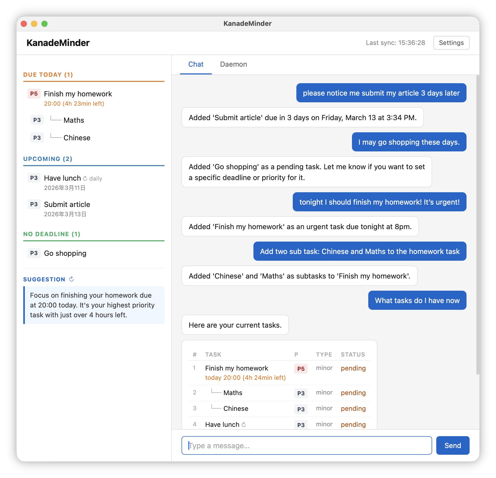

# KanadeMinder

KanadeMinder is a personal task manager powered by an LLM. Tell it what you need to do in plain English — it figures out the details, tracks deadlines, and nudges you at the right time so nothing slips through.



---

## What it does

- **Chat to manage tasks.** "Add a meeting with John on Friday, high priority." Done.
- **Reminds you automatically.** A background scheduler checks your tasks and sends timely notifications — overdue items, what's due today, and a suggestion for what to focus on next.
- **Stays out of your way.** No forms, no tags, no manual sorting. Tasks are prioritized and organized for you.

---

## Get started on macOS

**1. Build the app**

```bash
git clone <repo-url>
cd KanadeMinderAPP
uv sync && make all
```

**2. Install**

```bash
make install
```

You can use the desktop app on macOS. Open KanadeMinder and start typing.

All personal data is storaged in `~/.kanademinder/` . Never push online. 

---

## Linux / Windows

No desktop app, but the full chat experience is available in the terminal or browser.

```bash
uv sync
kanademinder config setup
kanademinder chat        # terminal
kanademinder web         # browser at http://127.0.0.1:8080
```

## Notifications

You can use this to enable background reminders. Or use `daemon` tab on macOS desktop app. 

```bash
kanademinder install
```

---

## Requirements

- Python 3.11+, [uv](https://github.com/astral-sh/uv)
- An API key for OpenAI, Anthropic, or any OpenAI-compatible provider

---

## License

MIT. All codes are generated with the help of Claude Code. For study only, please do not use this project in formal case. 

